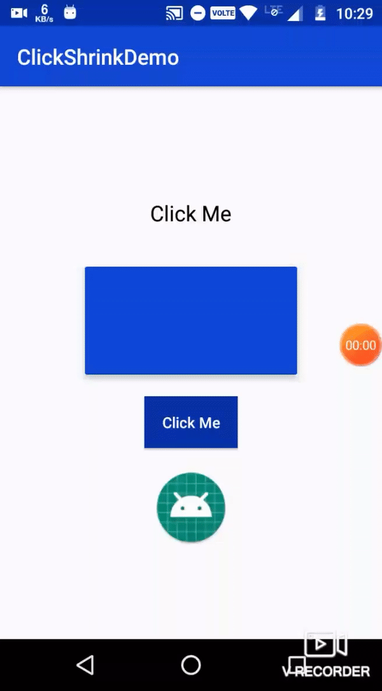

# Click Shrink Effect
<p>This library add <b>a shrinking effect on any 'View' </b>while clicking.</p>

[](https://github.com/Hardik8184/ClickShrinkEffect/blob/master/LICENSE) &nbsp;&nbsp;&nbsp;&nbsp;
[]( https://android-arsenal.com/details/1/7966 )

<div>
  <p align="center">Built with ❤︎ by
	  <a href="https://github.com/Hardik8184">Hardik Dungrani</a></p>
</div>

## Demo




## 💻 Installation
Add this in your app's build.gradle file:
```groovy

allprojects {
   repositories {
	    maven { url 'https://jitpack.io' }
   }
}

dependencies {
    implementation 'com.hardik.clickshrinkeffect:shrinkeffect:1.0.0'
}
```

## ❔ Usage
**Basic Usage**

Kotlin:
```
  fab.applyClickShrink()
  cardView.applyClickShrink()
  textView.applyClickShrink()
  imageView.applyClickShrink()
```

Java:
```
ClickShrinkEffectKt.applyClickShrink(fab);
ClickShrinkEffectKt.applyClickShrink(cardView);
    // OR
new ClickShrinkEffect(fab);
new ClickShrinkEffect(cardView);
```


# 📃 License

    Copyright 2019 Hardik Dungrani

    Licensed under the Apache License, Version 2.0 (the "License");
    you may not use this file except in compliance with the License.
    You may obtain a copy of the License at

       http://www.apache.org/licenses/LICENSE-2.0

    Unless required by applicable law or agreed to in writing, software
    distributed under the License is distributed on an "AS IS" BASIS,
    WITHOUT WARRANTIES OR CONDITIONS OF ANY KIND, either express or implied.
    See the License for the specific language governing permissions and
    limitations under the License.

### If you like the library, please click on the ★ Star button at the top 😊
